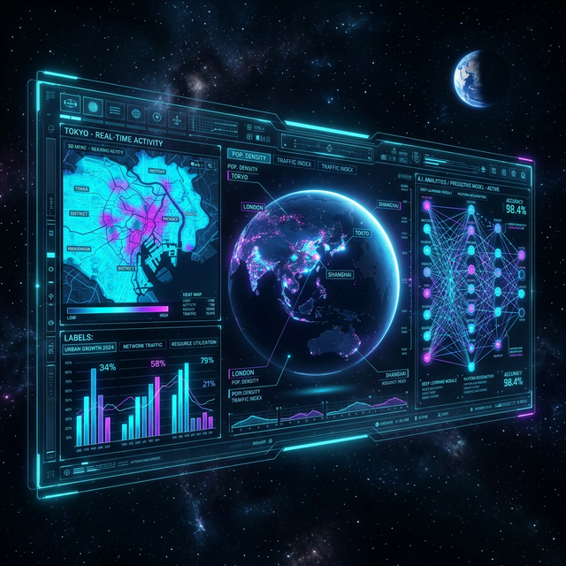

# EV Intelligence Platform

**AI-Driven EV Infrastructure & Policy Intelligence System**

---

## 👥 Team Members
| Name | Role | Responsibilities |
| :--- | :--- | :--- |
| **Somil Doshi** | Lead Dashboard Developer | Streamlit UI, visual analytics, project scaffolding |
| **Nisarg** | Data Engineer & Analyst | Data processing (DuckDB, Parquet), EDA, Analytics tools |
| **Parva** | AI & RAG Engineer | Policy docs scraping, Pinecone setup, local Ollama embeddings |
| **MD** | Agentic Workflow Engineer | LangGraph routing, tool calling, chatbot logic |
| **Smit** | QA Lead & Tech Writer | Unit testing, documentation, demo scripting |

---

## What this is

A full-stack analytics platform that combines 276,000+ Washington State EV registration records with a local LLM (Ollama), a vector RAG pipeline (Pinecone), and a LangGraph agentic workflow — all served through a Streamlit dashboard.

**Three pages:**
- **Dashboard** — interactive Plotly/Folium visualizations, glassmorphism KPI cards, adoption trend charts
- **AI Chat** — natural language queries answered by a LangGraph agent with RAG source citations
- **Charger Optimizer** — K-Means clustering to suggest optimal EV charging station locations, with What-If radius analysis and GeoJSON export

**Features:**
- County-level EV growth forecasting (Prophet + ARIMA fallback)
- LangGraph chart generation tool (5 chart types from natural language)
- RAG source reveal drawer in chat
- Prometheus observability metrics on port 8502
- Full Docker Compose stack with health-checked startup

---

## 📷 Screenshots



---

## 🛠 Tech Stack

| Technology | Version | Purpose |
| :--- | :--- | :--- |
| **Python** | `3.10+` | Core backend programming language |
| **Streamlit** | `1.32.0+` | Frontend web framework |
| **DuckDB** | `0.10.0+` | Fast analytical database |
| **Pandas** | `2.2.0+` | Data manipulation |
| **LangGraph** | `0.0.26+` | Agentic workflow orchestration |
| **Ollama** | `latest` | Local LLM (`llama3.2`) and embeddings (`nomic-embed-text`) |
| **Pinecone** | `3.0.0+` | Serverless vector database |
| **Docker** | `24.0+` | Containerization |
| **Pytest** | `latest` | Testing framework |

---

## Quick Start (Docker)

**Requirements:** Docker Desktop, 8 GB RAM free, ~6 GB disk (model weights)

```bash
# 1. Clone and enter the project
git clone <repo-url>
cd EV_Project

# 2. Configure environment
cp .env.example .env
# edit .env → set PINECONE_API_KEY

# 3. Start everything
docker compose up -d --build

# 4. Pull the LLM models (first time only)
docker compose exec ollama ollama pull llama3.2
docker compose exec ollama ollama pull nomic-embed-text

# 5. Initialize vector DB (first time only)
docker compose exec streamlit python scripts/setup_rag.py

# 6. Open the dashboard
# Access at http://localhost:8501
```

---

## Maintenance & Commands

| Action | Command |
|--------|---------|
| Start Containers | `docker compose up -d` |
| Stop Containers | `docker compose down` |
| View Logs | `docker compose logs -f streamlit` |
| Run Tests | `docker compose run --rm streamlit pytest tests/ -v` |
| Reset Environment | `docker compose down -v` |
| Enable Monitoring | `docker compose --profile monitoring up -d` (Access at port 9090) |

---

## Project Structure

```
EV_Project/
├── app.py                          # Landing page + Prometheus metrics
├── pages/
│   ├── 1_Dashboard.py              # Analytics dashboard
│   ├── 2_Chat.py                   # AI chat with RAG source drawer
│   └── 3_Charger_Optimizer.py      # K-Means charger placement
├── src/
│   ├── forecasting/
│   │   └── forecaster.py           # EVForecaster — Prophet + ARIMA
│   ├── tools/
│   │   └── chart_tool.py           # LangGraph chart generation tool
│   ├── components/
│   │   └── metrics.py              # Glassmorphism KPI cards
│   └── pages/
│       └── charger_optimizer.py    # Optimizer business logic
├── scripts/
│   ├── requirements.txt
│   ├── agent_workflow.py           # LangGraph 4-node workflow
│   ├── analytics_tools.py          # DuckDB query functions
│   ├── rag_query.py                # Pinecone RAG chain
│   └── setup_rag.py                # One-time vector DB indexer
├── data/
│   ├── processed/
│   │   └── Electric_Vehicle_Population_Data.parquet
│   └── policy/                     # Markdown policy docs for RAG
├── tests/
│   └── test_forecaster.py
├── Dockerfile.streamlit
├── docker-compose.yml
└── prometheus.yml
```

---

## 📄 License

This project is licensed under the MIT License - see the LICENSE file for details.

